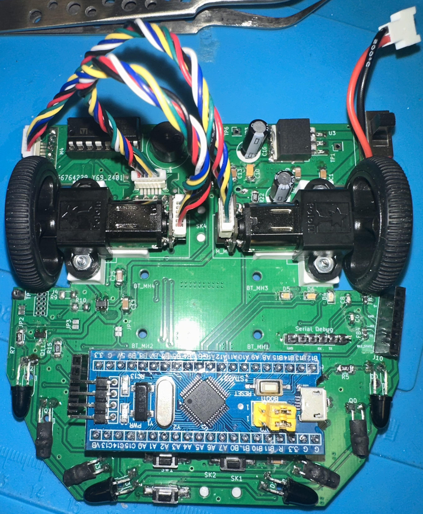

# Micromouse : Institute of Electrical and Electronics Engineers

**Macro Rat** is an autonomous maze-solving robot implementing a FloodFill traversal algorithm on bare-metal embedded hardware. This repository documents the process undertaken by our IEEE team, covering firmware architecture, hardware bring-up, and algorithmic design.

---

# Robotics

This repository captures the end-to-end development of a Micromouse platform built during Fall quarter (sophomore year) at UC Irvine under the IEEE student branch. The project involved designing a custom PCB, writing low-level firmware for an STM32 microcontroller, and implementing a real-time maze-solving algorithm. Documentation covers hardware integration, peripheral configuration, and software architecture, intended for engineers looking to understand the full system stack, not just the surface-level assembly.

---

# Hardware

- **STM32 MCU** — Core processing unit; handles sensor polling, motor control loops, and algorithm execution.
- **Custom PCB Chassis** — Rigid mounting platform with routed power and signal traces for all subsystems.
- **Mini DC Motors (×2)** — Differential drive configuration enabling forward motion and zero-radius turning.
- **7–9V Battery Pack** — Main power supply for the drive and logic subsystems.
- **7805 Linear Voltage Regulator** — Regulates battery input down to a stable 5V rail for digital logic.
- **H-Bridge Motor Driver** — Bidirectional motor control with PWM speed modulation.
- **Hall-Effect Rotary Encoders** — Quadrature feedback for closed-loop odometry and velocity estimation.
- **Infrared Distance Sensors (×2)** — Wall proximity detection used as primary inputs to the navigation state machine.

---

# Project Overview

Macro Rat is a ground-up embedded systems project targeting the core competencies of real-time control, sensor fusion, and autonomous decision-making. The robot executes a FloodFill algorithm to map and solve an unknown maze, dynamically updating its internal cell-cost representation as new wall data is acquired from the IR sensor array.

The firmware was developed in **STM32CubeIDE** and interfaces directly with hardware peripherals via HAL and low-level register access. Key engineering challenges included tuning PID loops for stable motor control, handling encoder debounce at speed, and managing real-time constraints within a cooperative scheduling model.

The project also served as a platform for structured team collaboration responsibilities were partitioned across firmware, hardware, and algorithm development, with integration milestones tracked across the full academic year. This mirrors real-world embedded development workflows and exposes contributors to the full V-model design cycle: from requirements through verification.

Contributions, forks, and improvements are welcome.

